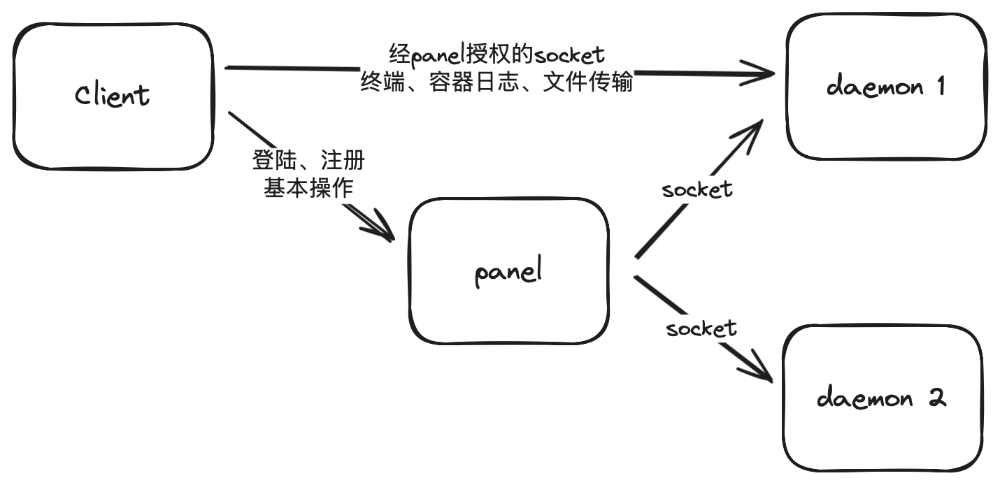
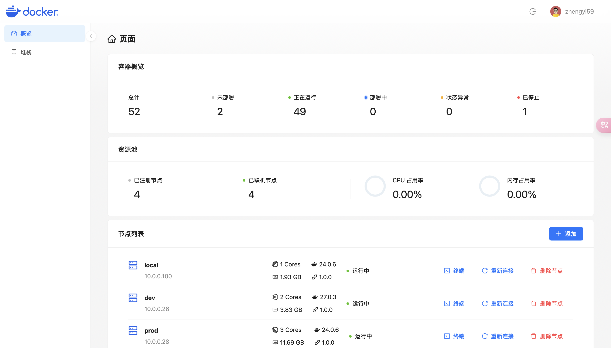
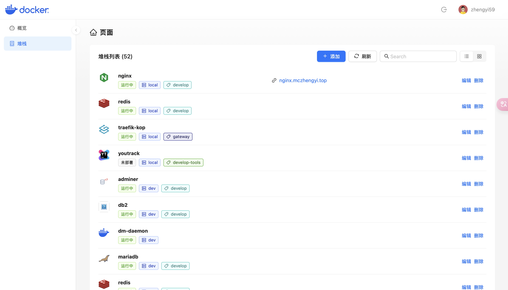
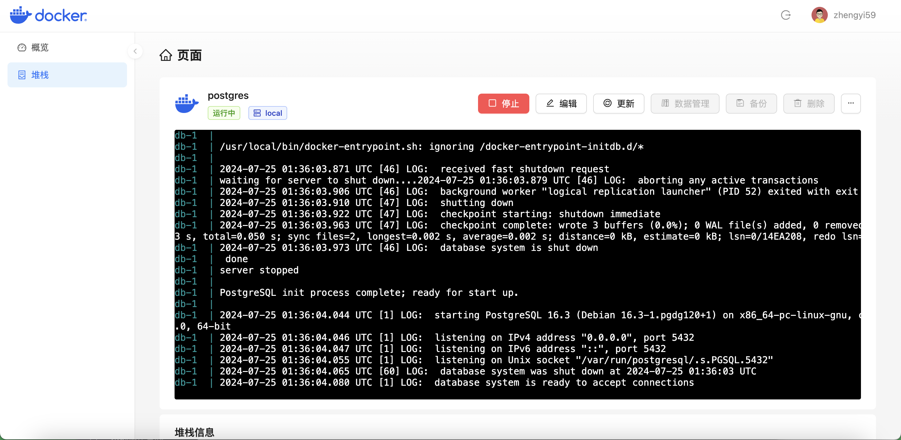

# Docker 容器管理平台

> 开发中的项目

该工具计划用于在我的服务器上替代 Dockge，同时也是学习下 TS 后端的开发和 React 框架的使用。

## 特点

- 可视化的 compose 操作
- 实时的日志展示
- 支持连接多个节点
- dockge 扩展属性支持
- 支持应用图标、标签，支持禁用容器编辑
- 支持自动识别 traefik label，展示域名

## 计划的功能

- [ ] 仪表盘
- [ ] 多节点
- [ ] 堆栈管理
- [ ] 镜像管理
- [ ] 堆栈备份
- [ ] 应用商店（规划）

## 技术栈

### 前端 UI

- Vite
- React
- React Router
- Ant Design
- Ant Design Pro Component
- Ant Design Charts

### Daemon / Mng

- Koa
- Socket.io
- systeminformation

## 鸣谢

- Dockge: 该项目的部分代码与架构设计参考了该项目
- MCSManager：该项目的部分代码与架构设计参考了该项目

## 架构图

## 截图

<table>
<tr>
<td></td>
<td></td>
</tr>
<tr>
<td></td>
<td></td>
</tr>
</table>